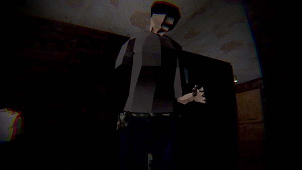
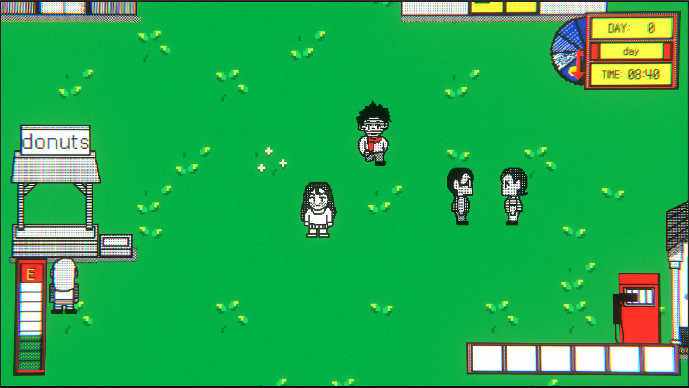
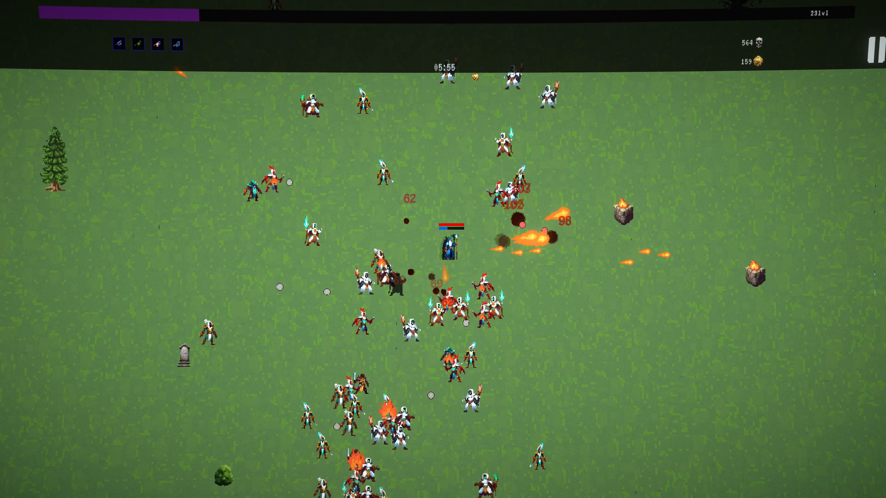
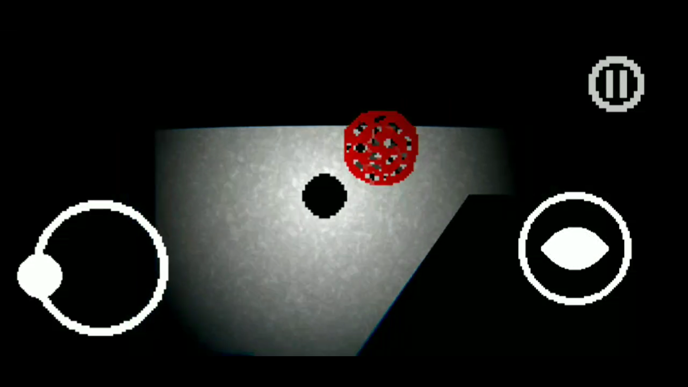
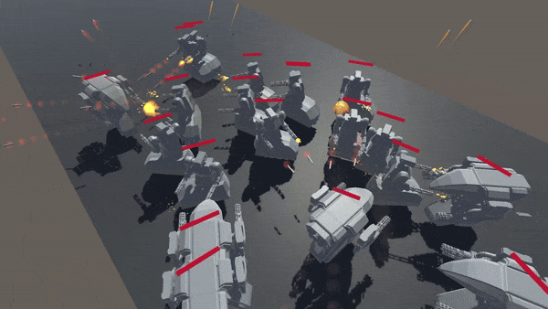
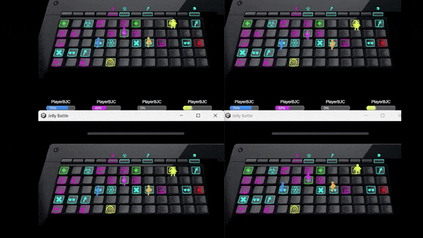
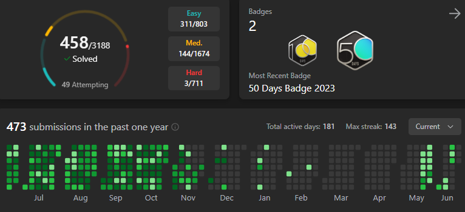

# Hello!

I'm a programmer with experience in creating a variety of games on Unity, from mobile horror, puzzles to complex 3D shooters. Below are some of my key projects I have worked on.

<iframe width="600" height="330" src="https://www.youtube.com/embed/dOGdcaSmLE8?si=w_u8GS7tbIwK3pXb" title="YouTube video player" frameborder="0" allow="accelerometer; autoplay; clipboard-write; encrypted-media; gyroscope; picture-in-picture; web-share" referrerpolicy="strict-origin-when-cross-origin" allowfullscreen></iframe>

---

### Projects

## Lullaby of Hunger

**Description**: A 3D horror shooter for PC.

<iframe width="560" height="315" src="https://www.youtube.com/embed/tgxWWx9oRBs?si=ZnGdGeWb0kL7NFtu" title="YouTube video player" frameborder="0" allow="accelerometer; autoplay; clipboard-write; encrypted-media; gyroscope; picture-in-picture; web-share" referrerpolicy="strict-origin-when-cross-origin" allowfullscreen></iframe>

**Unique Mechanics**: Inversive kinematics for realistic aiming and reloading, isometric and first-person camera switches, complex enemy behaviors and responses on being shot.

**Skills Learned**: Animation rigging, ragdoll, observer pattern, level design, 3D modeling, animating, complex game settings, localization.

**Links**:
- [Itch.Io Link](https://pinkthing.itch.io/lullaby-of-hunger)
- [More Information](https://www.behance.net/gallery/201274647/Lullaby-Of-Hunger)

---

## The Ordinary World

**Description**: 2D top-down game for PC.

**Unique Mechanics**: Complex dialogue system, NPC schedules, game events, mini-games.

**Skills Learned**: Complex dialogue system, NPC behavior design, coding and design for 2D games.

**Links**:
- [Itch.Io Link](https://ordinaryworldgame.itch.io/ordinary-world)
- [Kickstarter](https://www.kickstarter.com/projects/ordinaryworld/ordinary-world-the-video-game-0?ref=user_menu) 

---

## Magic Assault

**Description**: A mobile run-and-gun game with a complex spell-casting mechanic.

<iframe width="560" height="315" src="https://www.youtube.com/embed/LhD1Jo8dpi4?si=-h3UHhLYU35ogLzi" frameborder="0" allow="accelerometer; autoplay; encrypted-media; gyroscope; picture-in-picture" allowfullscreen></iframe>

**Unique Mechanics**: Drawing spells on screen to cast them with different elemental powers, enemies responses to different elemental damage.

**Skills Learned**: Random level and enemy generation, complex input systems, complex elemtal system.

**Links**:
- [GooglePlay Link](https://play.google.com/store/apps/details?id=com.PinkThing.MagicAssault&hl=en&gl=US)
- [More Information](https://www.behance.net/gallery/191525399/Magic-Assault)
- [Yandex Games Link](https://yandex.ru/games/app/293707?utm_source=app_page)

---

## Close Your Eyes

**Description**: A 2D hardcore horror puzzle for mobile.

<iframe width="560" height="315" src="https://www.youtube.com/embed/jfJetNccV8Y?si=a_O85Jap6q9El3Wd" frameborder="0" allow="accelerometer; autoplay; encrypted-media; gyroscope; picture-in-picture" allowfullscreen></iframe>

**Unique Mechanics**: Pathfinding AI, Unity lighting system, mobile joystick input.

**Skills Learned**: AI pathfinding, level design, lighting effects, mobile controls.

**Links**:
- [Itch.Io Link](https://pinkthing.itch.io/close-your-eyes)
- [Yandex Games Link](https://yandex.ru/games/app/293705?utm_source=app_page)
- [GooglePlay Link](https://play.google.com/store/apps/details?id=com.PinkThing.com.unity.template.CloseYourEyes&hl=en&gl=US)
- [More Information](https://www.behance.net/gallery/191466445/Close-Your-Eyes)

---

## Other Works/Projects

### Prototypes

## MechGuard

**Description**: A prototype mechs tower defense, built using Unitys DOTS and ECS.

**Unique Mechanics**: Implementation of ECS and DOTS for efficient game logic processing. This prototype includes basic AI behaviors.

**Skills Learned**: DOTS, ECS, Jobs System, Burst Compiler.

---

### Prototypes

## Jelly Battle

**Description**: A prototype multiplayer arcade.

**Unique Mechanics**: Grid generation. Passive & active skills. Multiplayer connection.

**Skills Learned**: Photon Fusion, Multiplayer, Object pool, Factory.

---

### LeetCode

I have solved problems with C# on [LeetCode](https://leetcode.com/u/s0dya/).

---

Thank you for checking out my portfolio. I am always eager to take on new challenges and collaborate on exciting projects. Feel free to reach out if you are interested in working together or have any questions about my work!
