# Hello!

I'm a game developer with experience in creating a variety of games on Unity, from mobile horror, puzzles to complex 3D shooters. Below are some of my key projects showcasing my skills and the unique mechanics I have developed.

<iframe width="960" height="600" src="https://www.youtube.com/embed/Txi0ZCo5lIg?si=E_fji96mTxfimcDq" title="YouTube video player" frameborder="0" allow="accelerometer; autoplay; clipboard-write; encrypted-media; gyroscope; picture-in-picture; web-share" referrerpolicy="strict-origin-when-cross-origin" allowfullscreen></iframe>

---
---

### Projects

## Lullaby of Hunger

**Description**: A 3D horror shooter for PC.

<iframe width="560" height="315" src="https://www.youtube.com/embed/tgxWWx9oRBs?si=ZnGdGeWb0kL7NFtu" title="YouTube video player" frameborder="0" allow="accelerometer; autoplay; clipboard-write; encrypted-media; gyroscope; picture-in-picture; web-share" referrerpolicy="strict-origin-when-cross-origin" allowfullscreen></iframe>

**Unique Mechanics**: Inversive kinematics for realistic aiming and reloading, isometric and first-person camera switches, complex enemy behaviors and responses on being shot.

**Skills Learned**: Animation rigging, ragdoll, observer pattern, level design, 3D modeling, animating, complex game settings, localization.

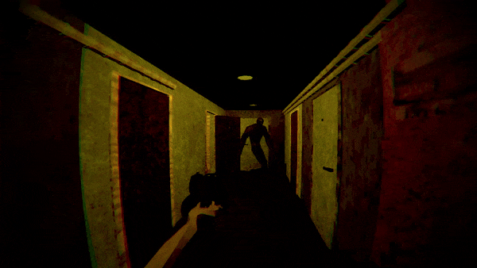

**Links**:
- [Itch.Io Link](https://pinkthing.itch.io/lullaby-of-hunger)
- [More Information](https://www.behance.net/gallery/201274647/Lullaby-Of-Hunger)

---

## Gnome Run
**Description**: 3D runner game for WebGL and mobile.

<iframe width="560" height="315" src="https://www.youtube.com/embed/7cgUq30jhZI?si=K20QyfvWNuMGGC75" title="YouTube video player" frameborder="0" allow="accelerometer; autoplay; clipboard-write; encrypted-media; gyroscope; picture-in-picture; web-share" referrerpolicy="strict-origin-when-cross-origin" allowfullscreen></iframe>

**Unique Mechanics**: Advanced level generation system using an array-based editor script.

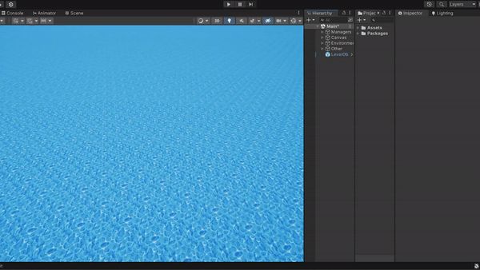

**Skills Learned**: Level generation algorithms, procedural content creation, Zenject, multiplatform development.

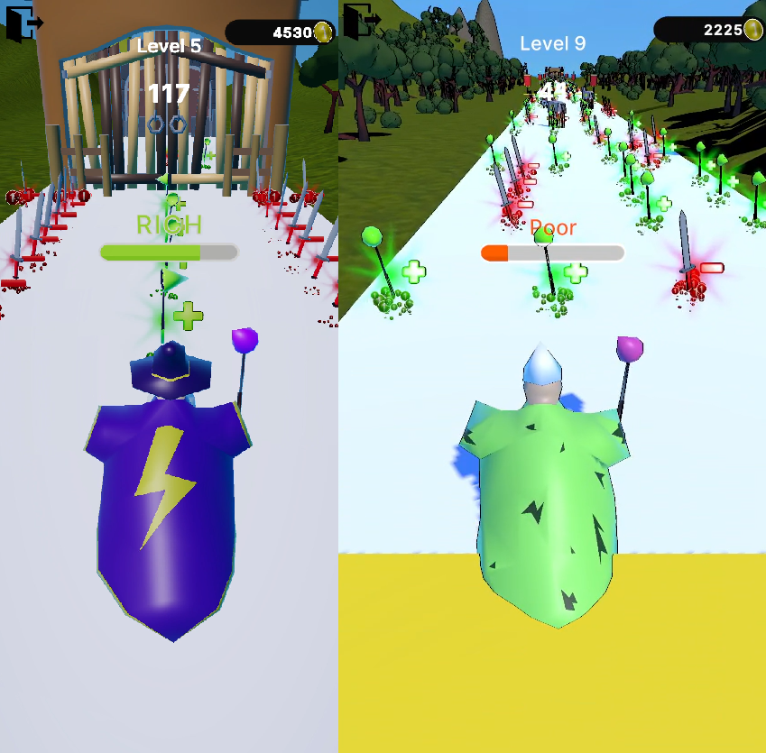

**Links**:
- [GooglePlay Link](https://play.google.com/store/apps/details?id=com.PinkThing.GnomeRun&hl=en&gl=US)
- [Itch.io Link](https://pinkthing.itch.io/gnome-run)
- [Yandex Games Link](https://yandex.ru/games/app/365475?utm_source=app_page)

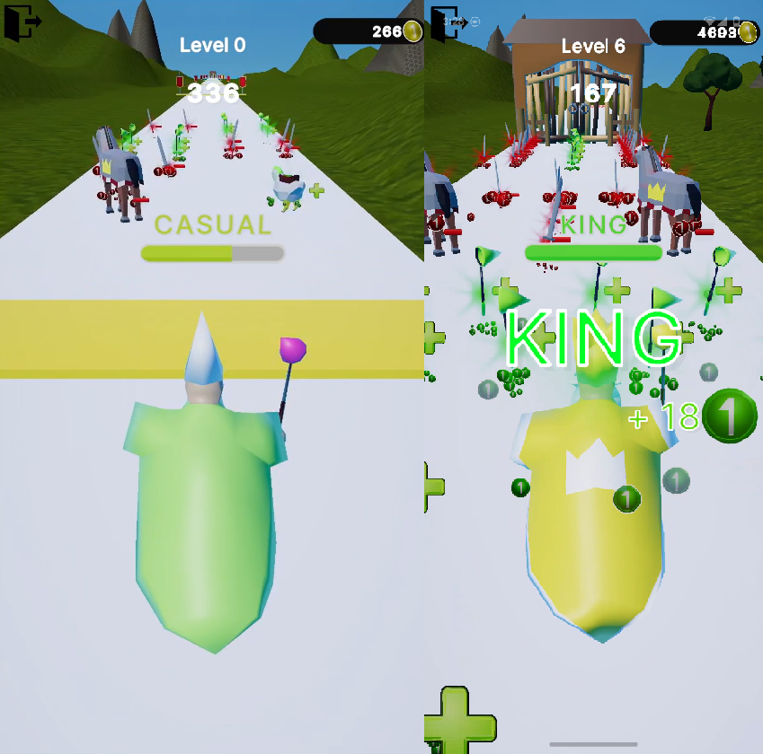

---

## The Ordinary World

**Description**: 2D top-down game for PC.

**Unique Mechanics**: Complex dialogue system, NPC schedules, game events, mini-games.

**Skills Learned**: Complex dialogue system, NPC behavior design, coding and design for 2D games.

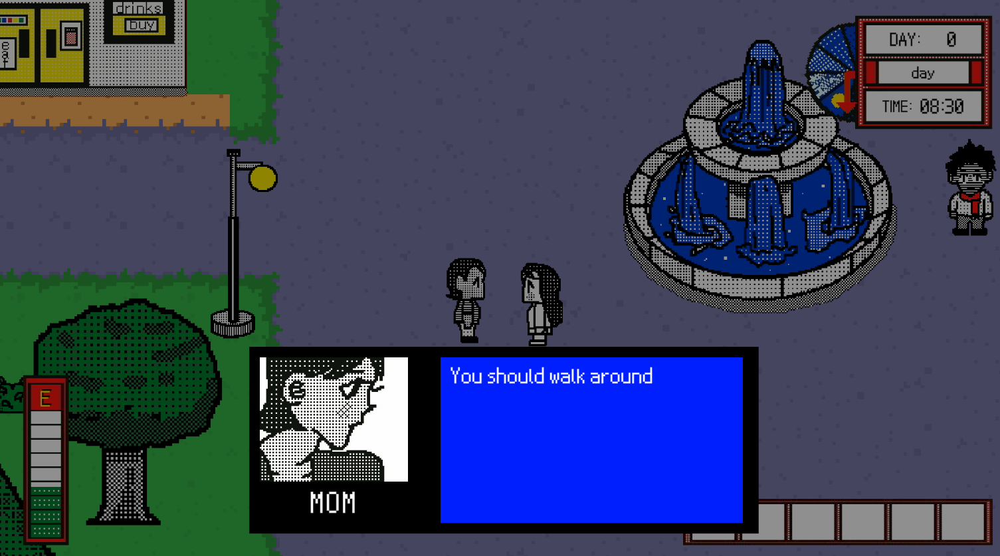

**Links**:
- [Itch.Io Link](https://ordinaryworldgame.itch.io/ordinary-world)
- [Kickstarter](https://www.kickstarter.com/projects/ordinaryworld/ordinary-world-the-video-game-0?ref=user_menu) 

---

## MUTAStones

**Description**: A fast-paced hardcore arcade game created in 3 days for [ScoreSpace Jam #28](https://itch.io/jam/scorejam28) game jam. Ranked 75th out of 176 entries.

<iframe width="560" height="315" src="https://www.youtube.com/embed/q-DC6EmSG_w?si=WR3DVisEz1n2M-K4" frameborder="0" allow="accelerometer; autoplay; encrypted-media; gyroscope; picture-in-picture" allowfullscreen></iframe>

**Unique Mechanics**: Player mutates by killing enemies and receiving their abilities to reach highest score among other players.

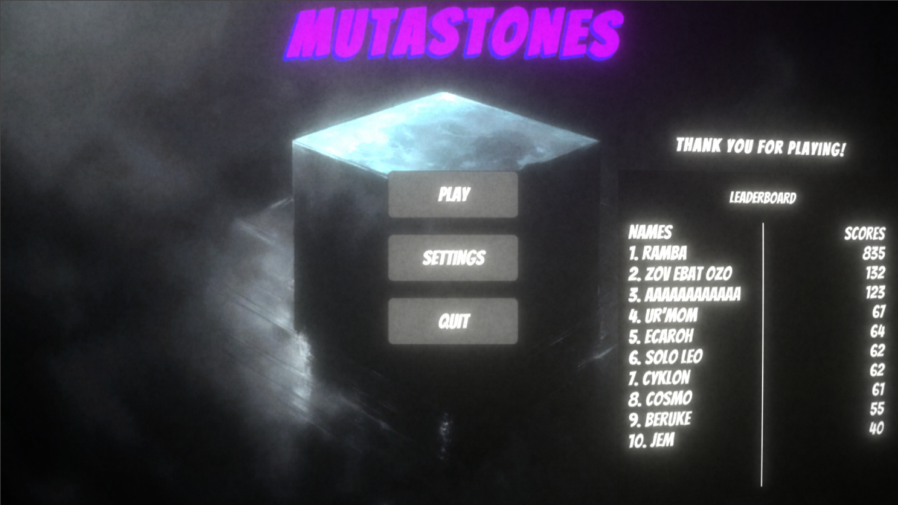

**Skills Learned**: Leaderboards integration, game jam development, web platform deployment.

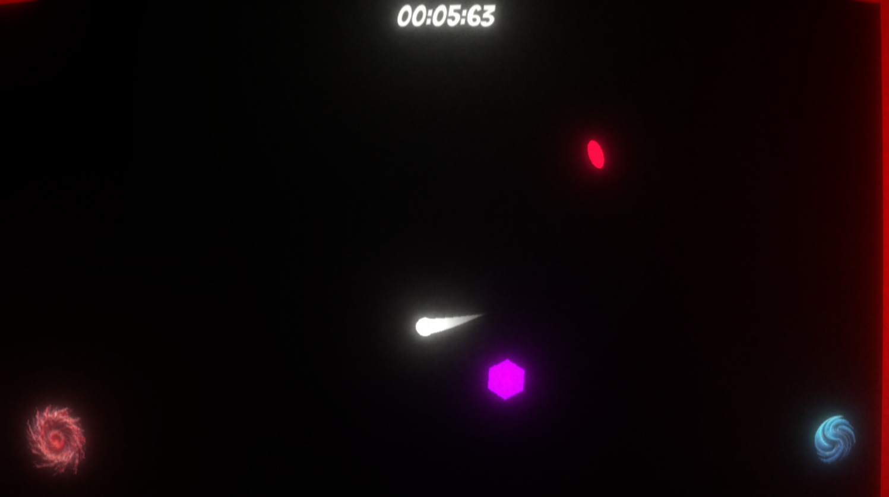

**Links**:
- [Itch.Io Link](https://pinkthing.itch.io/mutastones)
- [More Information](https://www.behance.net/gallery/191524553/MUTAstones)

---

## Magic Assault

**Description**: A mobile run-and-gun game with a complex spell-casting mechanic.

<iframe width="560" height="315" src="https://www.youtube.com/embed/LhD1Jo8dpi4?si=-h3UHhLYU35ogLzi" frameborder="0" allow="accelerometer; autoplay; encrypted-media; gyroscope; picture-in-picture" allowfullscreen></iframe>

**Unique Mechanics**: Drawing spells on screen to cast them with different elemental powers, enemies responses to different elemental damage.

**Skills Learned**: Random level and enemy generation, complex input systems, complex elemtal system.

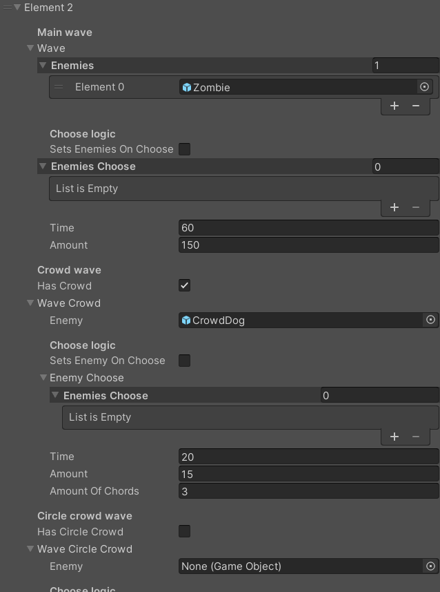

**Links**:
- [GooglePlay Link](https://play.google.com/store/apps/details?id=com.PinkThing.MagicAssault&hl=en&gl=US)
- [More Information](https://www.behance.net/gallery/191525399/Magic-Assault)
- [Yandex Games Link](https://yandex.ru/games/app/293707?utm_source=app_page)

---

## Rush Hour Driver

**Description**: A mobile arcade racing game.

<iframe width="560" height="315" src="https://www.youtube.com/embed/IOjK1EagMMc?si=fgX0u7YQ0usBkNfl" frameborder="0" allow="accelerometer; autoplay; encrypted-media; gyroscope; picture-in-picture" allowfullscreen></iframe>

**Unique Mechanics**: 3D game development, racing mechanics, boosts mechanic.

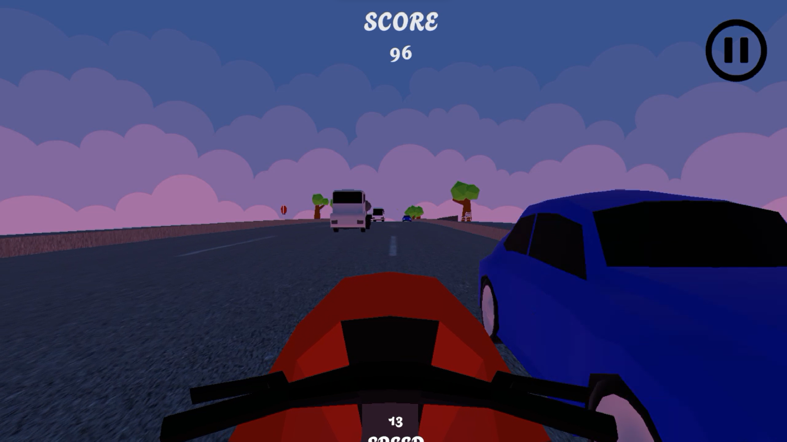

**Skills Learned**: 3D game creation, racing game dynamics.

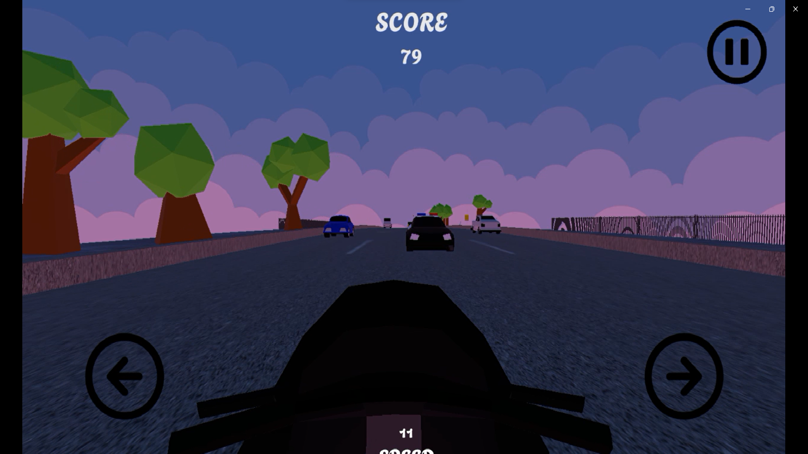

**Links**:
- [GooglePlay Link](https://play.google.com/store/apps/details?id=com.PinkThing.RushHourDriver&hl=en&gl=US)

---

## Close Your Eyes

**Description**: A 2D hardcore horror puzzle for mobile.

<iframe width="560" height="315" src="https://www.youtube.com/embed/jfJetNccV8Y?si=a_O85Jap6q9El3Wd" frameborder="0" allow="accelerometer; autoplay; encrypted-media; gyroscope; picture-in-picture" allowfullscreen></iframe>

**Unique Mechanics**: Pathfinding AI, Unity lighting system, mobile joystick input.

**Skills Learned**: AI pathfinding, level design, lighting effects, mobile controls.

**Links**:
- [Itch.Io Link](https://pinkthing.itch.io/close-your-eyes)
- [Yandex Games Link](https://yandex.ru/games/app/293705?utm_source=app_page)
- [GooglePlay Link](https://play.google.com/store/apps/details?id=com.PinkThing.com.unity.template.CloseYourEyes&hl=en&gl=US)
- [More Information](https://www.behance.net/gallery/191466445/Close-Your-Eyes)

---

## Other Works/Projects

### Prototypes

## MechGuard

**Description**: A prototype mechs tower defense, built using Unitys DOTS and ECS.

**Unique Mechanics**: Implementation of ECS and DOTS for efficient game logic processing. This prototype includes basic AI behaviors.

**Skills Learned**: DOTS, ECS, Jobs System, Burst Compiler.

---

### Prototypes

## Jelly Battle

**Description**: A prototype multiplayer arcade.

**Unique Mechanics**: Grid generation. Passive & active skills. Multiplayer connection.

**Skills Learned**: Photon Fusion, Multiplayer, Object pool, Factory.

---

### LeetCode

I have solved problems with C# on [LeetCode](https://leetcode.com/u/s0dya/).

---

### Blender

I have created models of environments and characters for "Lullaby of Hunger" and other personal projects. I also created animations using Blenders Rigify.

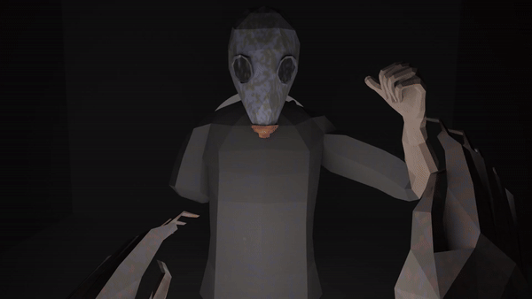

**Skills Learned**: 3D modeling, texturing, character rigging, animation, environment design.

---

Thank you for checking out my portfolio. I am always eager to take on new challenges and collaborate on exciting projects. Feel free to reach out if you are interested in working together or have any questions about my work!
