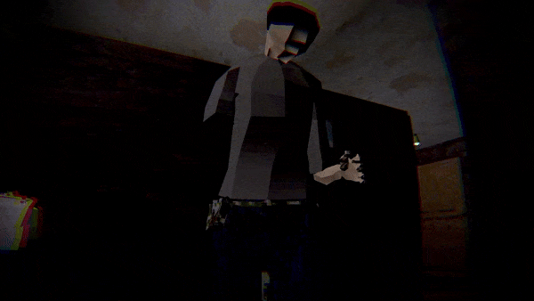

# Hello!

I'm a passionate game developer with experience in creating a variety of games on Unity, from mobile horror puzzles to complex 3D shooters. Below are some of my key projects showcasing my skills and the unique mechanics I have developed.

### Projects

## Lullaby of Hunger

**Description**: A 3D horror shooter for PC where player navigates through the visions of a crazy ex-police officer in an old Soviet building.

<iframe width="560" height="315" src="https://www.youtube.com/embed/tgxWWx9oRBs?si=ZnGdGeWb0kL7NFtu" title="YouTube video player" frameborder="0" allow="accelerometer; autoplay; clipboard-write; encrypted-media; gyroscope; picture-in-picture; web-share" referrerpolicy="strict-origin-when-cross-origin" allowfullscreen></iframe>

**Unique Mechanics**: Inversive kinematics for realistic aiming and reloading, isometric and first-person camera switches, complex enemy behaviors and responses on being shot.

**Skills Learned**: Animation rigging, ragdoll, observer pattern, level design, 3D modeling, animating, complex game settings, localization.

**Links**:
- [Itch.Io Link](#https://pinkthing.itch.io/lullaby-of-hunger)
- [Source Code](#https://github.com/S0dya/LullabyOfHunger)
- [More Information](#https://www.behance.net/gallery/201274647/Lullaby-Of-Hunger)

---

## Gnome Run
**Description**: A vibrant 3D runner game where players guide a gnome through a series of randomly generated levels, collecting good items and avoiding obstacles.

<iframe width="560" height="315" src="https://www.youtube.com/embed/7cgUq30jhZI?si=K20QyfvWNuMGGC75" title="YouTube video player" frameborder="0" allow="accelerometer; autoplay; clipboard-write; encrypted-media; gyroscope; picture-in-picture; web-share" referrerpolicy="strict-origin-when-cross-origin" allowfullscreen></iframe>

**Unique Mechanics**: Advanced level generation system using an array-based editor script that randomizes level parts while maintaining proper distances and orientations. This feature introduces varied gameplay experiences each time the game is played.

**Skills Learned**: Level generation algorithms, procedural content creation, Zenject, multiplatform development.

**Links**:
- [GooglePlay Link]([#https://ordinaryworldgame.itch.io/ordinary-world](https://play.google.com/store/apps/details?id=com.PinkThing.GnomeRun&hl=en&gl=US))
- [Source code](https://github.com/S0dya/Gnome-Run)

---

## The Ordinary World

**Description**: A 2D top-down game where player needs to earn money to leave a town in a limited amount of time by playing mini-games and interact with NPCs. Created for [Tayolor Blossom](#https://www.instagram.com/blossom_eats_rice/).

[Kickstarter](#https://www.kickstarter.com/projects/ordinaryworld/ordinary-world-the-video-game-0?ref=user_menu) 

**Unique Mechanics**: Complex dialogue system, NPC schedules, observer pattern, in-game mini-games.

**Skills Learned**: Complex dialogue system, NPC behavior design, coding and design for 2D games.

**Links**:
- [Itch.Io Link](#https://ordinaryworldgame.itch.io/ordinary-world)

---

## MUTAStones

**Description**: A fast-paced hardcore arcade game created in 72h for [ScoreSpace Jam #28](#https://itch.io/jam/scorejam28) game jam (mutation topic and necessary mechanic of leaderboards). Ranked 75th out of 176 entries.

<iframe width="560" height="315" src="https://www.youtube.com/embed/q-DC6EmSG_w?si=WR3DVisEz1n2M-K4" frameborder="0" allow="accelerometer; autoplay; encrypted-media; gyroscope; picture-in-picture" allowfullscreen></iframe>

**Unique Mechanics**: Player mutates by killing enemies and receiving their abilities to reach highest score among other players.

**Skills Learned**: Leaderboards integration, game jam development, web platform deployment.

**Links**:
- [Itch.Io Link](https://pinkthing.itch.io/mutastones)
- [Source Code](https://github.com/S0dya/MUTAStones)
- [More Information](https://www.behance.net/gallery/191524553/MUTAstones)

---

## Magic Assault

**Description**: A mobile run-and-gun game with a complex spell-casting mechanic.

<iframe width="560" height="315" src="https://www.youtube.com/embed/LhD1Jo8dpi4?si=-h3UHhLYU35ogLzi" frameborder="0" allow="accelerometer; autoplay; encrypted-media; gyroscope; picture-in-picture" allowfullscreen></iframe>

**Unique Mechanics**: Drawing spells on screen to cast them with different elemental advantages and disadvantages.

**Skills Learned**: Random level and enemy generation, complex input systems, complex elemtal system.

**Links**:
- [GooglePlay Link](#https://play.google.com/store/apps/details?id=com.PinkThing.MagicAssault&hl=en&gl=US)
- [Source Code](#https://github.com/S0dya/Magic-Assault)
- [More Information](#https://www.behance.net/gallery/191525399/Magic-Assault)

---

## Rush Hour Driver

**Description**: A mobile arcade racing game where player needs to avoid cars to survive as long as possible.

<iframe width="560" height="315" src="https://www.youtube.com/embed/IOjK1EagMMc?si=fgX0u7YQ0usBkNfl" frameborder="0" allow="accelerometer; autoplay; encrypted-media; gyroscope; picture-in-picture" allowfullscreen></iframe>

**Unique Mechanics**: Simple 3D game development, racing mechanics, boosts mechanic.

**Skills Learned**: 3D game creation, racing game dynamics.

**Links**:
- [GooglePlay Link](#https://play.google.com/store/apps/details?id=com.PinkThing.RushHourDriver&hl=en&gl=US)
- [Source Code](#https://github.com/S0dya/RushHourRider)

---

## Close Your Eyes

**Description**: A 2D hardcore horror puzzle with a unique eye-opening mechanic to navigate a dark world.

<iframe width="560" height="315" src="https://www.youtube.com/embed/jfJetNccV8Y?si=a_O85Jap6q9El3Wd" frameborder="0" allow="accelerometer; autoplay; encrypted-media; gyroscope; picture-in-picture" allowfullscreen></iframe>

**Unique Mechanics**: Pathfinding AI, Unity lighting system, mobile joystick input.

**Skills Learned**: AI pathfinding, level design, lighting effects, mobile controls.

**Links**:
- [Itch.Io Link](#https://pinkthing.itch.io/close-your-eyes)
- [GooglePlay Link](#https://play.google.com/store/apps/details?id=com.PinkThing.com.unity.template.CloseYourEyes&hl=en&gl=US)
- [Source Code](#https://github.com/S0dya/CloseYourEyes)
- [More Information](#https://www.behance.net/gallery/191466445/Close-Your-Eyes)

---

## Other Works/Projects

### Prototypes

## MechGuard

**Description**: A prototype for a strategy game featuring mechs, built using Unity's DOTS (Data-Oriented Technology Stack) and ECS (Entity Component System). The game showcases basic unit logic for movement, combat, and health management.

**Unique Mechanics**: Implementation of ECS and DOTS for efficient game logic processing. This prototype includes basic AI behaviors for mechs, demonstrating the potential for scalable and performant game systems.

**Skills Learned**: DOTS, ECS, Jobs System, Burst Compiler.

**Links**:
- [Source Code](https://github.com/S0dya/Mech-Guard)

---

### LeetCode

I have solved many problems using C# on [LeetCode](#https://leetcode.com/u/s0dya/), which has helped me improve my problem-solving skills and deepen my understanding of algorithms and data structures.

---

### Blender

I have created models of environments and characters for "Lullaby of Hunger" and other personal projects. I also created animations using Blender's Rigify.

**Skills Learned**: 3D modeling, texturing, character rigging, animation, environment design.

---

Thank you for checking out my portfolio. I am always eager to take on new challenges and collaborate on exciting projects. Feel free to reach out if you are interested in working together or have any questions about my work!
